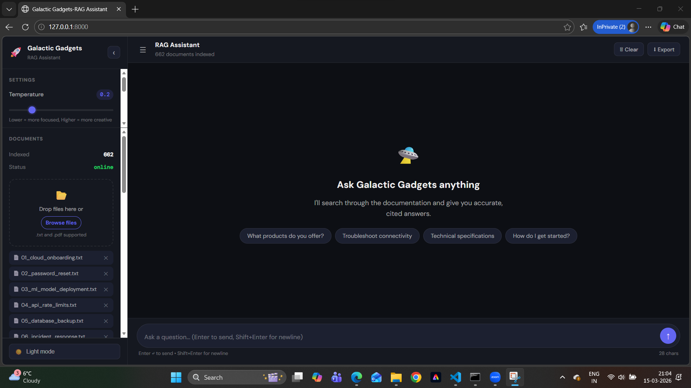
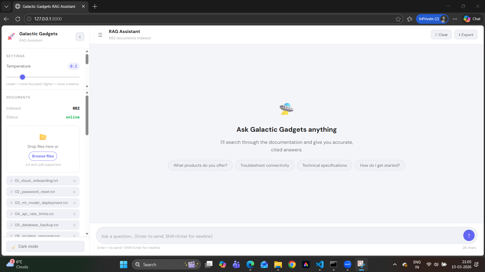
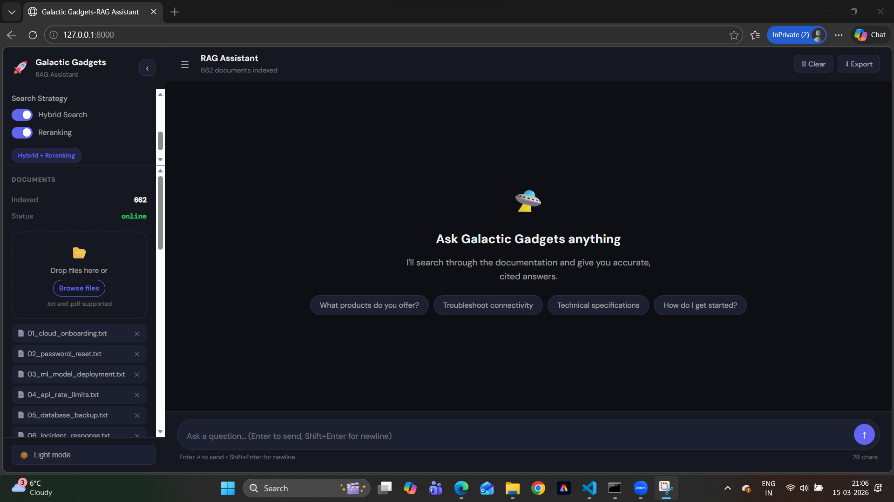

# P3: Galactic Gadgets RAG Assistant

A production-ready Retrieval-Augmented Generation (RAG) chatbot that answers customer questions about Galactic Gadgets products using company documentation. Built with FastAPI, ChromaDB, and Ollama.

## Optional Features Implemented

- **Option A — Conversation Memory**: Multi-turn conversations with rolling 5-turn context window
- **Option D — Advanced Search Controls**: UI toggles for hybrid search and reranking with strategy display
- **Option E — Document Upload**: Live document upload, indexing, and management through the UI

---

## Screenshots

### Dark Mode Chat Interface:


### Light Mode


### Search Strategy Controls


---
## About:

This system combines semantic document retrieval with local LLM generation to produce accurate, cited answers from company documentation. Unlike a standard chatbot, it never fabricates information — if the answer isn't in the documents, it says so.

The pipeline:

```
User Question
     ↓
Semantic Search  →  finds relevant document chunks
     ↓
Reranker         →  cross-encoder selects the best chunks
     ↓
LLM + Context    →  generates a cited answer
     ↓
Answer + Sources
```

### What's New in P3 vs P2 and Lab 6

P2 delivered the retrieval engine — semantic search, reranking, and hybrid BM25 search. Lab 6 added basic LLM integration with Ollama. P3 brings everything together:

- Full chat interface with message history, timestamps, and source display
- RAG endpoint combining retrieval and generation
- Conversation memory across multiple turns
- Dynamic search strategy controls in the UI
- Live document upload and management
- Comprehensive error handling for LLM timeouts and failures
- 98% test coverage with CI/CD pipeline

---

## Project Structure

```
p3/
├── .github/workflows/
│   └── ci.yml                  # CI/CD pipeline
├── README.md
├── .gitignore
├── .env                        # Local config (not committed)
├── .env.example                # Template for environment variables
├── pyproject.toml
├── documents/                  # Indexed documents (.txt and .pdf)
├── static/
│   ├── index.html              # Chat interface
│   ├── style.css               # Styling with light/dark themes
│   └── chat.js                 # Chat functionality
├── src/
│   └── retrieval/
│       ├── main.py             # FastAPI app with RAG endpoints
│       ├── llm.py              # LLM client (Ollama + OpenAI compatible)
│       ├── rag.py              # RAG orchestration
│       ├── retriever.py        # Document retrieval with reranking
│       ├── hybrid.py           # BM25 + semantic hybrid search
│       ├── reranker.py         # Cross-encoder reranking
│       ├── embeddings.py       # Sentence transformer embeddings
│       ├── store.py            # ChromaDB vector store
│       └── loader.py           # Document loading and chunking
└── tests/
    ├── test_smoke.py
    ├── test_chunking.py
    ├── test_embeddings.py
    ├── test_hybrid.py
    ├── test_integration.py
    ├── test_llm.py
    ├── test_main.py
    ├── test_rag.py
    ├── test_retriever.py
    ├── test_store.py
    ├── test_coverage.py
    └── data/                   # Test documents
```

---

## Setup Instructions

### Prerequisites

- Python 3.11+
- [uv](https://docs.astral.sh/uv/) package manager
- [Ollama](https://ollama.com/) for local LLM inference

### 1. Install Ollama

Download and install from [ollama.com](https://ollama.com/), then pull the default model:

```bash
ollama pull qwen2.5:3b
ollama run qwen2.5:3b
```

Verify Ollama is running:

```bash
curl http://localhost:11434/api/tags
```

You should see `qwen2.5:3b` in the response.

### 2. Clone and Install Dependencies

```bash
git clone <your-repo-url>
cd p3
uv sync
```

### 3. Configure Environment

Copy the example environment file:

```bash
cp .env.example .env
```

Edit `.env` as needed (defaults work for local Ollama):

```dotenv
LLM_BASE_URL=http://localhost:11434
LLM_MODEL=qwen2.5:3b
LLM_TIMEOUT=180
DEFAULT_CONTEXT_DOCS=3
DEFAULT_TEMPERATURE=0.7
```

### 4. Add Documents

Place `.txt` or `.pdf` files in the `documents/` directory. The system indexes them automatically on startup.

### 5. Start the Server

```bash
uv run uvicorn src.retrieval.main:app --reload
```

Open your browser at [http://localhost:8000](http://localhost:8000).

---

## Usage

### Chat Interface

Open [http://localhost:8000](http://localhost:8000) in your browser. Type a question and press Enter.

Each response includes:
- The generated answer
- Expandable source cards showing which document chunks were used
- Relevance scores for each source

### API

The RAG endpoint can be called directly:

```bash
curl -X POST http://localhost:8000/rag \
  -H "Content-Type: application/json" \
  -d '{
    "question": "What is the password reset policy?",
    "n_context_docs": 3,
    "temperature": 0.7
  }'
```

Response:

```json
{
  "question": "What is the password reset policy?",
  "answer": "According to Document 1, passwords must be reset every 90 days...",
  "sources": [...],
  "n_docs_retrieved": 3
}
```

### Health Check

```bash
curl http://localhost:8000/health
```

---

## Configuration Options

All options can be set via environment variables with sensible defaults:

| Variable | Default | Description |
|---|---|---|
| `LLM_BASE_URL` | `http://localhost:11434` | Ollama or OpenAI base URL |
| `LLM_MODEL` | `qwen2.5:3b` | Model name |
| `LLM_API_KEY` | none | API key (required for OpenAI) |
| `LLM_TIMEOUT` | `180.0` | Request timeout in seconds |
| `DEFAULT_CONTEXT_DOCS` | `3` | Number of docs retrieved per query |
| `DEFAULT_TEMPERATURE` | `0.7` | LLM sampling temperature |
| `MAX_CONTEXT_DOCS` | `10` | Maximum allowed context docs |
| `DOCUMENTS_DIR` | `documents` | Directory for indexed documents |

---

## Optional Features

### Option A — Conversation Memory

The system tracks the last 5 question-answer pairs and includes them in every new request as conversation context. This allows natural follow-up questions without repeating context.

**How it works:**

In `chat.js`, `buildConversationHistory()` collects the last 5 exchanges and sends them with each request. In `main.py`, the backend injects them into the LLM system prompt:

```python
system_prompt = (
    f"Previous conversation:\n{history_text}\n\n"
    "Use the above for context when answering follow-up questions."
)
```

The context window is capped at 5 turns to stay within LLM token limits. The Clear button wipes conversation history completely.

### Option D — Advanced Search Controls

The sidebar provides full control over the retrieval strategy:

- **Hybrid Search toggle** — combines BM25 keyword matching with semantic embeddings using Reciprocal Rank Fusion. Better for exact technical terms.
- **Reranking toggle** — adds a cross-encoder second pass that re-scores the top 20 results. More accurate, slightly slower.
- **Strategy badge** — displays the active combination in real time.
- **Settings persistence** — all settings saved to localStorage and restored on reload.

Four strategy combinations:

| Hybrid | Reranking | Strategy |
|---|---|---|
| Off | Off | Semantic only |
| Off | On | Semantic + Reranking (default) |
| On | Off | Hybrid (BM25 + Semantic) |
| On | On | Hybrid + Reranking |

The backend switches strategy dynamically per request via `_update_retriever_strategy()` — no server restart required.

### Option E — Document Upload

Upload new documents through the sidebar without restarting the server:

- Drag and drop or browse for `.txt` and `.pdf` files
- Progress bar shows upload and indexing status
- Document list shows all indexed files with delete buttons
- 10MB file size limit with validation
- Automatic re-indexing after upload or delete
- Document count updates instantly in the header

**Endpoint:**

```bash
curl -X POST http://localhost:8000/upload \
  -F "file=@myDocument.pdf"
```

---

## Running Tests

```bash
uv run pytest --cov=src/retrieval --cov-report=term-missing
```

All 203 tests pass without Ollama or the uvicorn server running. LLM calls are fully mocked.

### Coverage Report

```
src/retrieval/embeddings.py    100%
src/retrieval/hybrid.py        100%
src/retrieval/llm.py           100%
src/retrieval/rag.py            97%
src/retrieval/reranker.py      100%
src/retrieval/store.py         100%
src/retrieval/retriever.py     100%
src/retrieval/loader.py         99%
src/retrieval/main.py           95%
TOTAL                           99%
```

### Test Architecture

- **Unit tests** — each module tested in isolation with mocks
- **RAG tests** — full pipeline tested with mocked LLM and retriever
- **Integration tests** — all FastAPI endpoints tested via TestClient, no live server needed
- **Coverage tests** — targeted tests for all error handling and edge case branches

---

## CI/CD Pipeline

The GitHub Actions pipeline runs on every push and pull request:

```yaml
jobs:
  ci:
    steps:
      - ruff format --check    # formatting
      - ruff check             # linting
      - mypy src/retrieval     # type checking
      - pytest --cov           # tests + coverage
```

All four checks must pass before code is considered deployable.

---

## Linting and Formatting

Check formatting:

```bash
uv run ruff format --check .
```

Check linting:

```bash
uv run ruff check .
```

Run type checking:

```bash
uv run mypy src/retrieval
```

Auto-fix formatting:

```bash
uv run ruff format .
```

---

*Seattle University — ARIN 5360 — P3*
*Author: Aarti Dashore*
*Guided By: Prof. Kevin Lundeen*