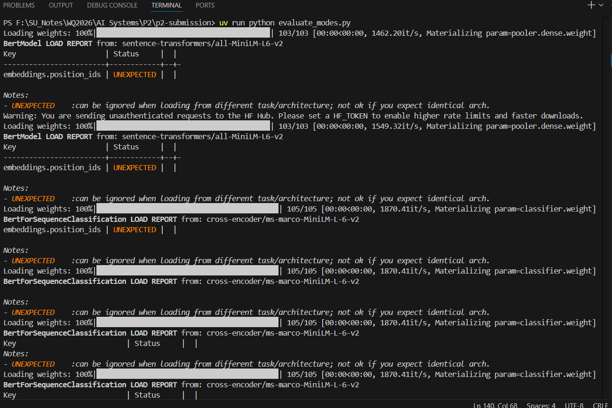
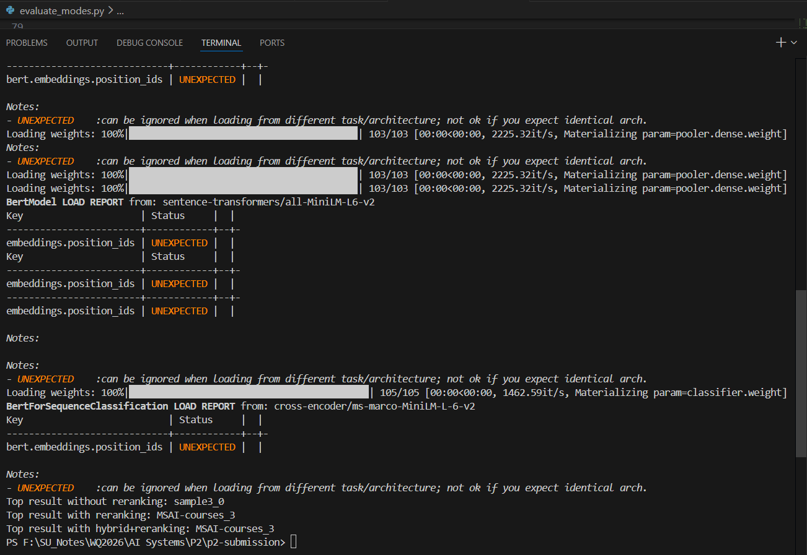

# P2: Advanced Document Retrieval System

Advanced document retrieval system for ARIN 5360.

This project enhances semantic search with cross-encoder reranking and hybrid search (BM25 + RRF) for production-grade document retrieval. The system implements a two-stage pipeline combining bi-encoder speed with cross-encoder accuracy - the same architecture used by Google and Elasticsearch.

## Programmatic Usage

#### Comparing different approaches
query = "machine learning algorithms"

Mode 1: Baseline (Semantic Only)
```python
from retrieval.retriever import DocumentRetriever

retriever = DocumentRetriever(use_reranking=False, use_hybrid=False)
retriever.index_documents("documents")
results = retriever.search(query, n_results=5)
```
Mode 2: With Reranking
```python
retriever = DocumentRetriever(use_reranking=True, use_hybrid=False)
retriever.index_documents("documents")
results = retriever.search(query, n_results=5)
# Results include rerank_score field
```
Mode 3: Hybrid Search
```python
retriever = DocumentRetriever(use_reranking=False, use_hybrid=True)
retriever.index_documents("documents")
results = retriever.search(query, n_results=5)
# Results include rrf_score field
```
Mode 4: Full System (All Features)
```python
retriever = DocumentRetriever(use_reranking=True, use_hybrid=True)
retriever.index_documents("documents")
results = retriever.search(query, n_results=5)
# Results include both rerank_score and rrf_score
```

#### Results:
Executing in terminal:


Output:


## Quick Start

```bash
# Install dependencies
uv sync

# Start server
uv run uvicorn src.retrieval.main:app --reload
```

Server starts at http://localhost:8000

## Usage

### Via API

**Check health:**

```bash
curl http://localhost:8000/health
```

### Via Browser

Visit http://localhost:8000 (requires `static/index.html`).

## Testing

Run all Tests with coverage

```Bash
uv run pytest
```

Run any specific files

```bash
uv run pytest .tests\test_store.py\
```

## Code Quality

Run the ruff checks for linting
`uv run ruff check .`

Fixing the lint:
`uv run ruff check --fix`

Check the formatting:
`uv run ruff format --check .`

Formatting the code:
`uv run ruf format .`

## Project Structure

```
L3-retriever/
├── documents/
│   ├── 01_cloud_onboarding.txt
│   ├── 02_password_reset.txt
│   ├── 03_ml_model_deployment.txt
│   ├── 28_cloud_cost_optimization.txt
│   ├── 29_feature_flag_usage.txt
│   ├── ...
│   ├── 30_internal_wiki_usage.txt
│   ├── dracula_by_bram_stoker.txt
│   ├── MSAI-courses.pdf
│   ├── sample1.txt
│   ├── sample2.txt
│   ├── sample3.txt
│   └── sample4.txt
│
├── evaluate_modes_images/
│   ├── eval_1.png
│   └── eval_2.png
├── evaluate_modes.py
|
├── images/
│   ├── q5_1.png
│   └── q5.png
|
├── src/
│   └── retrieval/
│       ├── __init__.py
│       ├── embeddings.py
│       ├── hybrid.py
│       ├── loader.py
│       ├── main.py
│       ├── reranker.py
│       ├── retriever.py
│       └── store.py
│
├── static/
│   ├── index.html
│   └── style.css
│
├── tests/
│   ├── __pycache__/
│   ├── data/
│   ├── __init__.py
│   ├── conftest.py
│   ├── test_chunking.py
│   ├── test_embeddings.py
│   ├── test_hybrid.py
│   ├── test_integration.py
│   ├── test_loader.py
│   ├── test_main.py
│   ├── test_p2_hybrid.py
│   ├── test_p2_reranking.py
│   ├── test_reranker.py
│   ├── test_retriever.py
│   ├── test_smoke.py
│   └── test_store.py
│
├── .gitignore
├── .python-version
├── README.md
├── image.png
├── image2.png
├── pyproject.toml
└── uv.lock
```

# Architecture:

- Loader: Reads .txt file from the documents/
- Embedder: Converts text to vector using sentenc-transformers
- Store: Manages chromadb collections for similarity search
- Retriever: Coordinates components for end-to-end retrieval
- API: FastAPI endpoints for heath checks and search
- Chunking: Test file for document chunking and document loader.
- Reranker: CrossEncoderReranker class
- Rybrid: BM25 + RRF implementation